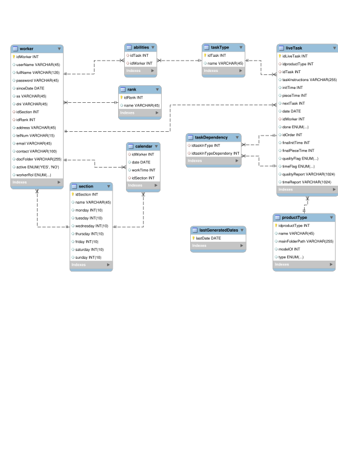

# OnDemandPlanner 

## Planificador para trabajos a demanda para talleres y fábricas.

### El Problema

Partimos de la base de la estructura típica de un taller, o de una empresa que fabrica a demanda necesita planificar su producción. Desde la dirección bien sea el empresario único o una oficina técnica necesitan pasar de el pedido hasta la producción y poder controlar en esta primera version estos puntos:
* Los plazos de entrega
* La eficiencia del personal en tiempos

##### Que no pretende el sistema

Esta versión del software no pretende gestionar agendas de personal no ligado directamente a la producción, como son administrativos, prevención de riesgos, y aunque los que pretende es facilitar el trabajo de la oficina técnica, tampoco planifica su tiempo.

Esta versión del software no tiene en cuenta el uso del material sobre el pedido, por ende tampoco su rentabilidad económica, pero todo se andará.

Tampoco tiene en cuenta el control de materia prima ni el control de material elaborado o semi-elaborado, pero esta en previsión

### A que tipo de empresa está dirigido
Este sistema de organización esta planteado para controlar las agendas y agendar los procesos de fabricación de una empresa que cuenta con personas que producen y pueden contar con máquinas que les ayudan a ello. 
Ejemplos de talleres o fábricas que pueden implementar este modelo serían: 

- Una empresa de rótulos
- Una empresa de artes gráficas
- Un taller de cerrajería
- Un taller de reparación de vehículos
- Una carpintería
- Una fábrica de muebles a demanda
- Un taller de impresión digital
- [...]

A continuación aparecen los conceptos de gestión sobre los que se basa el modelo; si estos conceptos cuadran o pueden cuadrar en tu estructura de fabricación, esta puede ser candidata a la implantación.

### El pedido
El cliente demanda un pedido con uno o deferentes productos (o servicios) de cada artículo, se pueden pedir una o más copias.

EL pedido en esta version se ha de divivir el lineas individuales por producto e introducir una por una, dejando para versiones posteriores la implementación de una importacion y/o integración desde odoo, woocomerce o el programa de gestión de pedidos existente.

### El tipo de producto
Empezamos con un ejemplo:
**Mesa de melamina blanca** es un tipo de producto.
una mesa de melamina, sea del tamaño que sea tiene este proceso: 
- Se corta un tablero de melamina blanca.
- Se cantea con cinta de color blanco 
- Se le colocan x patas (normalmente 4) metálicas blancas y sus tapones
- Cortamos las planchas de cartón en una maquina que hace cajas a medida
- Se empaqueta con cartón cortado a medida y  rellenos de espuma de polietileno

En este modelo, un **tipo de producto** recoge todos aquellos productos que siguen el mismo proceso de fabricación, se ejecutan los mismos tipos de tareas en el mismo orden..

*En esta versión del software vamos a obviar el consumo de materia prima, pero lo dejamos preparado para su ampliación.

**Un modelo** de este tipo seria *"una mesa de melamina blanca de 120x60 cm"*
**Un pedido** podría incluir *cinco mesas de melamina blanca 120x60 *, para su proceso de **agendación**

*Este controlador estava previsto pero no implementado a fecha 5-06-2024:*

### La tarea
La tarea es una unidad de trabajo sobre un **modelo** pedido, donde un trabajjados cualificado para ella le será asignada

En el ejemplo del tipo **Mesa de melamina blanca** el proceso tendría las siguientes **tareas**:
- **Tarea** *corte*,  **responsable** *Vicente* con **capacidad** de realizar este tipo de tarea y adiestramiento en **maquina** *escuadradora*, en esta tarea se consumirá *tablero de melamina blanca* del almacén,
- **Tarea** *corte cnc* del embalaje **responsable** *Luis* , se consumirá *cartón* y *espuma de poliuretano* y se usará la **maquina** *Zünd*
- **Tarea** *canteado*, que en el momento de programar, la podrá hacer tanto Vicente como Luis, pues los dos tienen **capacidad** y no se necesita maquina para ello.
- **Tarea** *embalaje* , es una tarea de baja cualificación que todos los operarios tienen **capacidad** se elige por defecto el de menor coste.

De estas tareas , las dos de corte se pueden iniciar simultáneamente pues no se necesita el producto para hacerla, después el canteado y finalmente el embalaje.

### Trabajador
Se diferencia entre dos roles, el trabajador de administracion, y el trabajador de taller. Estos roles seleccionan la vista del programa. El trabajador de administracion puede dar alta y baja de trabajadores, así como secciones y calendarios, dar alta de tipos, modelos y pedidos, planificarlos. Tambien exixte un rol "root" que puede dar de alta y baja a administradores. Este usuario no se puede dar de baja.
El programa tambien aprovecha la bbdd para hacer gestion documental sobre las carpetas de documentación de cada empleado

### Capacitaciones
Para la correcta asignación de tareas es necesario que cada trabajador tenga bien definidas las tareas que es capaz de hacer, esto son las capacitaciones

### Calendarios
El sistema trabaja con calendarios jerarquizados y personalizados, es decir: existe un calendario general, el cual se aplica a toda la compañia si no existe un calendario específico. Existe un calendario de sección, que se aplica al alta de cada empleado. Estos calendarios son "plantillas semanales" 
En la gestion de calendarios se pueden modificar las plantillas o bien los calendarios individuales del cada operario. La ideea es poder preveer, permisos, fiestas, vacaciones, etc, con la suficiente antelación y que no afecte a la programación de la produccion.

Por la experiencia en pequeñas empresas es necesario llevar el control del calendario para todo el año en curso, incluso un poco más (hastael 1 de marzo) para poder cubrir sobradamente las posibles variaciones de la semana laboral del mes de enero.

Los calendarios se generan en cada creacion de un nuevo trabajador, en la primera ejecucion de la bbdd, y en el primer arranque del año.

*Este controlador no estaba finalizado a fecha 5-6-2024:*

### Vistas operarios

El concepto de la aplicacion del trabajador es que previo login, le muestre las tareas asignadas, divididas en tres listados:
un primer listado *REVIVISIÓN*son las tareas que recientemente se le han asignado para su revisión, dondo puede comprobar que la documentación ofrecida y el tiempo asignado es correcto, despues de validar, pasarán a la pestaña correspondiente:
La pestaña *HOY* le muestra las tareas asignadas para realizar el dia de hoy, y la *SIGUIENTES* verá el resto de tareas asignadas.

*no implementadas 5-6-2024*

E sistema de control de tiempos es lo mas trasparente posible al usuario, pueds cuenta el tiempo desde que abre la ventana para ver la documentacion como tiempo de preparacion, y activará la cuenta al pulsar "iniciar serie" 

Estas opciones son necesarias para ir quitando las tareas del listado.

## tecnologia empleada

El proyeco está realizado integramente en Java, con el soporte para aplicciones de escritorio del framework JavaFX.

La bbdd está contruida en MYSQL, accediendo a la misma desde el conector de java.

En cuanto al diseño de la BBDD quiza llame la atención un par de cosas: la tabla LiveTask, tiene relaciones sobre si misma, pues las tareas pueden ser dependientes entre si. 
Aunque hay tres conceptos similares, el Tipo, El modelo y el Pedido, que contienen tareas, la tabla que se usará es la misma. diferenciandose ademas de su relación con task type, con la existencia o no de datos de fecha y trabajador asignado.

En cuanto a el desarrollo se ha procurado en todo momento la separación estricta del modelo-vista- controlador, añadiendo una cuata capa, el acceso a datos, pues en cuestrion de vista se prevee poder tener acceso desde web o aplicacion movil sobre todo la parte de acceso del trabajador, y el acceso a datos independiente confiere una facilidad en migrar el tipo de base de datos a otras diferentes de MMYSQL como un SQLITE o MS Acces

El patron de diseño del modelo de administración es *Singleton* para garantizar que no se dupliquen los objetos incluso en acceso concurrente.

El acceso previsto de l parte del operario implica una consulta mínim a diaria sobre sus pedidos activos que se cargan en memoria de dispositovo para facilitar situaciones de conexiones lentas o inestables.

Happy planning!

